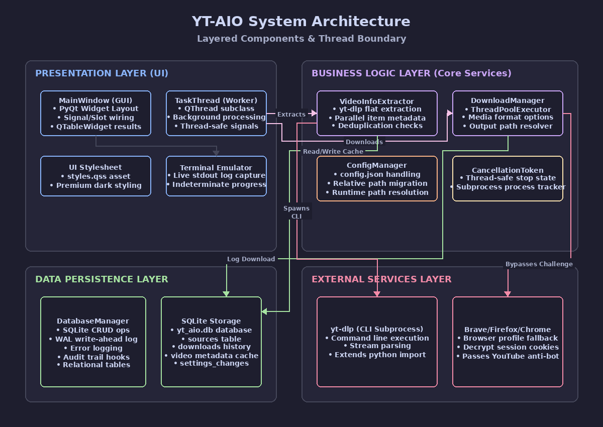
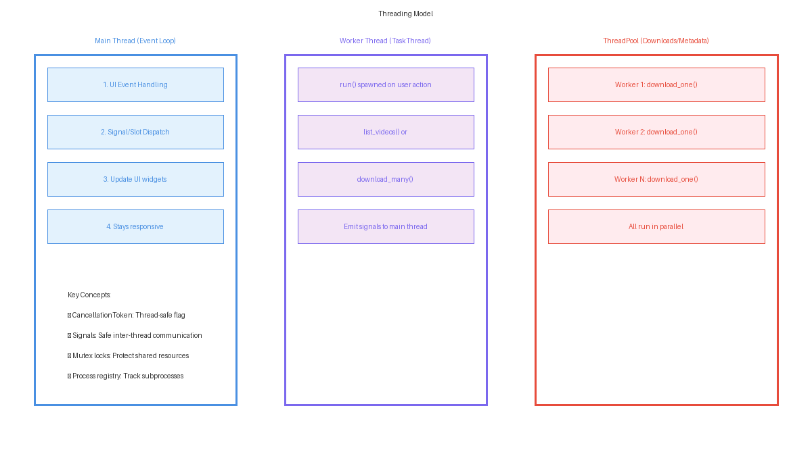
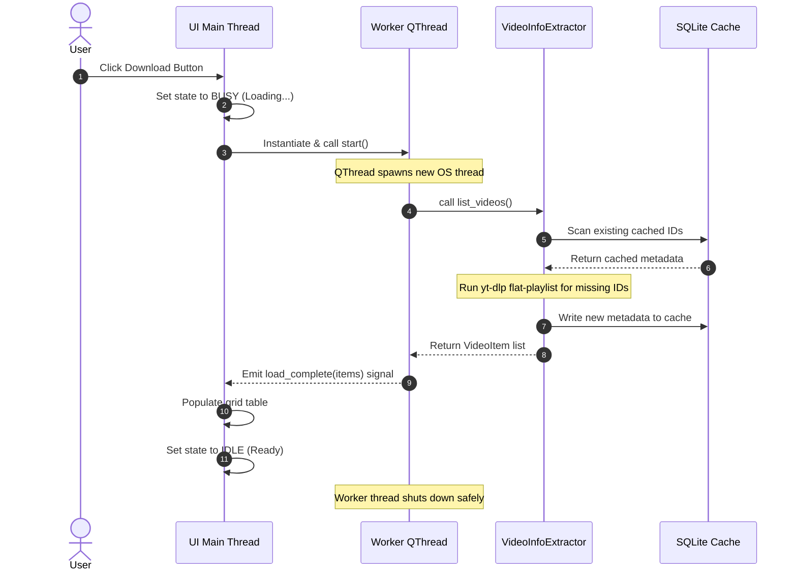
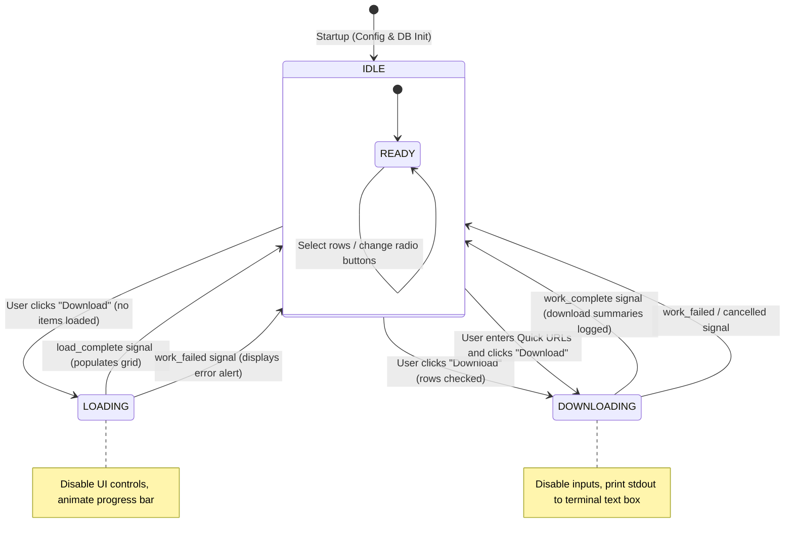
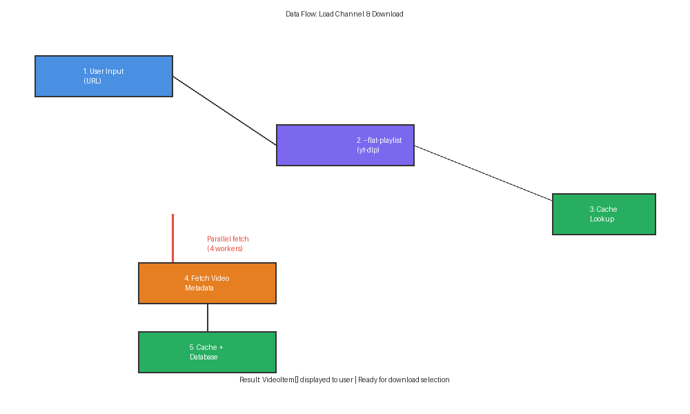

# 🏗️ Architecture, Threading, and Data Flow

This guide describes the system architecture design, multi-threading models, cancellation mechanics, and detailed step-by-step sequential workflows of **YT-AIO**.

---

## 1. System Architecture Diagram

YT-AIO relies on a modular separation of concerns. UI actions do not block the graphical interface, and all background work delegates down to core utility scripts and standard SQLite persistence.



---

## 2. Multi-Threading Model

PyQt applications operate on a single **Main UI Thread** that runs the Qt Event Loop. If a slow task (like querying the YouTube server or downloading a file) runs on this main thread, the user interface freezes and displays a "Not Responding" OS warning.

To prevent this, YT-AIO uses a **Worker Thread model**:

- **Main UI Thread**: Listens to clicks, parses textbox entries, updates status labels, updates table grids, and reacts to incoming signals from background workers.
- **Worker Thread ([TaskThread](file:///home/itzzinfinity/GitHub/yt_aio/yt_aio/application/jobs.py))**: Spawns an independent OS thread using `QThread` to execute the listing (`list_videos`) or batch downloading (`download_many`) logic.
- **Services Thread Pool**: Inside the background worker, heavy processes spawn child threads using python's `ThreadPoolExecutor` (e.g. up to 4 parallel workers for metadata fetches, and up to `CPU cores - 2` parallel workers for active subprocess downloads).



### Signal Flow Communication

Inter-thread communication is managed using Qt's thread-safe **Signals & Slots**:



---

## 3. Thread-Safe Cancellation Mechanics

When a download is running in the background, a user can click the **Stop** button. Because the downloader is executing child processes (`subprocess.Popen`), the cancellation must thread-safely propagate down and terminate these processes.

This is managed by the **[CancellationToken](file:///home/itzzinfinity/GitHub/yt_aio/yt_aio/application/utils/shared.py#L42)** class:
1. When a task starts, `DownloaderPanel` instantiates a `CancellationToken` and passes it to the `TaskThread`.
2. As the worker runs, any active subprocess register themselves into the token using `token.register(process)`.
3. If the user clicks **Stop**:
   - `DownloaderPanel` calls `cancel_token.cancel()`.
   - The token sets a thread-safe boolean flag `_cancelled = True`.
   - The token loops through all registered processes and calls `process.kill()` directly.
4. The background loops check `if token.is_cancelled():` and raise a `CancelledError` to abort operations cleanly.

---

## 4. UI State Machine

The main application window switches states to maintain safety (e.g. disabling buttons while a task is running to prevent double execution):



---

## 5. End-to-End Data Flow Workflows

### Loading Channel / Playlist Metadata

The data moves through several cache checks and subprocess pipelines before loading into the user interface:



1. **Input Stage**: User enters `@vsauce` and clicks **Download**.
2. **Path Selection**: `DownloaderPanel` detects that no data is loaded yet and triggers `start_load(source_kind="channel", source_value="@vsauce")`.
3. **Subprocess Call (Flat Scrape)**: `list_videos()` builds and runs:
   ```bash
   yt-dlp --flat-playlist --dump-single-json "https://www.youtube.com/@vsauce"
   ```
4. **ID Collection**: The output returns a list of JSON video IDs.
5. **Database Cache Check**: The script queries `youtube_video_information` for all found IDs.
6. **Parallel Extraction (Missing Items)**: For any IDs missing from the database, it runs parallel worker threads executing `yt-dlp -j "https://www.youtube.com/watch?v=ID"` to fetch details (titles, view counts, upload dates).
7. **Database Persistence**: New items are written to the database cache table.
8. **UI Binding**: The worker thread packages the list of `VideoItem` structures and emits `load_complete`, which binds the list and draws checkboxes in the PyQt table.

---

### Downloading Selected Videos

1. **Selection Stage**: User selects 3 rows in the UI grid and clicks **Download**.
2. **Extraction Stage**: `get_selected_items()` extracts the `VideoItem` objects linked to those checked rows.
3. **Orchestration**: Spawns `TaskThread` running `download_many()`.
4. **ThreadPool Dispatch**: Runs parallel jobs for each download:
   - Queries the cache to resolve titles.
   - Builds download arguments: e.g. for audio, format string `bestaudio[ext=m4a]/best`.
   - Spawns subprocess:
     ```bash
     yt-dlp -f "bestaudio[ext=m4a]/best" -o "~/Downloads/%(title)s.%(ext)s" "https://www.youtube.com/watch?v=ID"
     ```
   - Captures stdout progress lines (e.g. `[download] 42% ...`) and emits `log_message` to print in the UI.
5. **Anti-Bot Check**: If output contains HTTP 429 block patterns, it retrieves session cookies from Brave browser profiles and retries the command.
6. **Completion**: Persists success/failure statistics in the `downloads` table and logs errors to `errors` table, then sets the UI back to IDLE.

**Next Guide:** Read **[02_CODE_AND_MODULES.md](02_CODE_AND_MODULES.md)**
