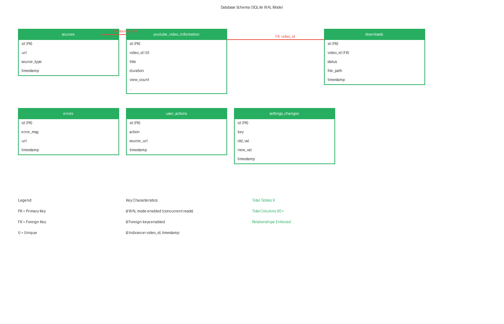

# 🗄️ Database Schema & Configuration

This guide details the SQLite database design, database indexes, entity-relationship structures, and configuration keys utilized by **YT-AIO**.

---

## 1. Database Schema Diagram

The database uses a relational structure for caching and history tracking, alongside standalone tables for general logging and configuration change histories.



---

## 2. Table Schemas & Definitions

File Scheme Link: [database_manager.py](file:///home/itzzinfinity/GitHub/yt_aio/yt_aio/application/db/database_manager.py)

Database File Location: [yt_aio.db](file:///home/itzzinfinity/GitHub/yt_aio/yt_aio/application/db/yt_aio.db) (created automatically on first run).

### Table: `sources`
Tracks channels and playlists that the user has searched or loaded.
```sql
CREATE TABLE sources (
    id INTEGER PRIMARY KEY AUTOINCREMENT,
    source_key TEXT NOT NULL UNIQUE,      -- Format: "channel:@username" or "playlist:PLAYLIST_ID"
    source_kind TEXT NOT NULL,             -- "channel" or "playlist"
    source_name TEXT,                      -- User-friendly name extracted from yt-dlp (e.g. "Vsauce")
    source_value TEXT NOT NULL,            -- Raw input string (e.g. "@vsauce" or "PLabc...")
    source_url TEXT,                       -- Resolved full URL
    created_at TEXT,                       -- ISO 8601 creation timestamp
    updated_at TEXT                        -- ISO 8601 update timestamp
);
CREATE INDEX idx_source_kind ON sources(source_kind);
```

### Table: `youtube_video_information`
Acts as a cache layer for video metadata, preventing redundant network requests.
```sql
CREATE TABLE youtube_video_information (
    id INTEGER PRIMARY KEY AUTOINCREMENT,
    video_id TEXT NOT NULL UNIQUE,         -- Unique YouTube video identifier
    title TEXT,                            -- Video title
    channel_name TEXT,                     -- Channel name (uploader)
    playlist_name TEXT,                    -- Playlist title (if queried as part of a playlist)
    upload_date TEXT,                      -- YYYYMMDD format
    duration INTEGER,                      -- Video length in seconds
    view_count INTEGER,                    -- Total view count
    like_count INTEGER,                    -- Total like count
    dislike_count INTEGER,                 -- Total dislike count (often null)
    comment_count INTEGER,                 -- Total comments count
    thumbnail_url TEXT,                    -- URL path to thumbnail image
    video_url TEXT,                        -- Full video URL
    source_id INTEGER,                     -- Foreign Key linking to sources.id
    cached_at TEXT,                        -- ISO 8601 cache write timestamp
    
    FOREIGN KEY(source_id) REFERENCES sources(id)
);
CREATE INDEX idx_video_id ON youtube_video_information(video_id);
CREATE INDEX idx_source_id ON youtube_video_information(source_id);
```

### Table: `downloads`
Logs the status and filepath of completed or failed download tasks.
```sql
CREATE TABLE downloads (
    id INTEGER PRIMARY KEY AUTOINCREMENT,
    title TEXT,                            -- Filename title
    url TEXT NOT NULL,                     -- Target stream URL
    status TEXT NOT NULL,                  -- "success" or "failed"
    error_message TEXT,                    -- Subprocess error description (if failed)
    timestamp TEXT NOT NULL,               -- ISO 8601 completion timestamp
    file_path TEXT,                        -- Target location of saved file on disk
    quality TEXT,                          -- Bitrate or format requested
    type TEXT NOT NULL,                    -- "audio" or "video"
    source_name TEXT,                      -- Target source container context (e.g. "Playlist A")
    video_id TEXT,                         -- YouTube video ID reference
    video_info_id INTEGER,                 -- Foreign Key linking to youtube_video_information.id
    source_id INTEGER,                     -- Foreign Key linking to sources.id
    
    FOREIGN KEY(video_info_id) REFERENCES youtube_video_information(id),
    FOREIGN KEY(source_id) REFERENCES sources(id)
);
CREATE INDEX idx_downloads_status ON downloads(status);
CREATE INDEX idx_downloads_timestamp ON downloads(timestamp);
```

### Standalone Logs Tables
These tables do not contain foreign key relationships and act as write-only logging sinks.

#### `errors`
Detailed traceback logs for debugging:
```sql
CREATE TABLE errors (
    id INTEGER PRIMARY KEY AUTOINCREMENT,
    error_message TEXT NOT NULL,           -- Primary error header
    timestamp TEXT NOT NULL,               -- ISO 8601 timestamp
    stack_trace TEXT,                      -- Full python traceback dump
    url TEXT,                              -- Related download/query URL
    action TEXT,                           -- Target operation (e.g. "load", "download")
    user_input TEXT,                       -- Raw textbox input string
    script_version TEXT,                   -- App version (e.g. "0.3.1")
    system_info TEXT                       -- Platform OS version details
);
```

#### `user_actions`
Audit log of UI events:
```sql
CREATE TABLE user_actions (
    id INTEGER PRIMARY KEY AUTOINCREMENT,
    action TEXT NOT NULL,                  -- "start", "stop", "clear", "open_config"
    timestamp TEXT NOT NULL                -- ISO 8601 timestamp
);
```

#### `settings_changes`
Log of modified configuration properties:
```sql
CREATE TABLE settings_changes (
    id INTEGER PRIMARY KEY AUTOINCREMENT,
    setting_name TEXT NOT NULL,            -- JSON key modified
    old_value TEXT,                        -- Value prior to save
    new_value TEXT,                        -- Value after save
    timestamp TEXT NOT NULL                -- ISO 8601 timestamp
);
```

#### `yt_aio_version`
Version history tracking:
```sql
CREATE TABLE yt_aio_version (
    id INTEGER PRIMARY KEY AUTOINCREMENT,
    version_number TEXT NOT NULL,          -- Version string
    release_date TEXT,                     -- Release timestamp
    changelog TEXT                         -- Short changelog summaries
);
```

---

## 3. SQL Query Cheatsheet

Below are common queries you can execute during debugging or data extraction:

### **Query 1: Get Download Success/Failure Rate**
```sql
SELECT status, COUNT(*) as count, (COUNT(*) * 100.0 / (SELECT COUNT(*) FROM downloads)) as percentage
FROM downloads
GROUP BY status;
```

### **Query 2: Find the Top 5 Cached Channels**
```sql
SELECT channel_name, COUNT(*) as video_count 
FROM youtube_video_information
GROUP BY channel_name
ORDER BY video_count DESC
LIMIT 5;
```

### **Query 3: Search Recent Error Tracebacks**
```sql
SELECT timestamp, action, error_message, stack_trace 
FROM errors 
ORDER BY timestamp DESC 
LIMIT 5;
```

---

## 4. Configuration Keys Schema

File Scheme Link: [config_manager.py](file:///home/itzzinfinity/GitHub/yt_aio/yt_aio/application/utils/config_manager.py)

Editable JSON file: [config.json](file:///home/itzzinfinity/GitHub/yt_aio/yt_aio/application/config/config.json)

The following properties configure the runtime behavior of the application:

| JSON Key | Default Value | Description |
|---|---|---|
| `"default_download_path"` | `"/home/user/Downloads"` | Root directory where downloads are saved. |
| `"default_video_quality"` | `"best"` | yt-dlp format parameter for video tasks. |
| `"default_audio_quality"` | `"m4a"` | Output format or target audio quality extension. |
| `"max_retries"` | `3` | Number of times a failed CLI call will be run again. |
| `"retry_delay"` | `5` | Time delay (in seconds) between retry requests. |
| `"log_file_path"` | `"./db/yt_aio.db"` | **Relative path** to the SQLite logging database. |
| `"log_level"` | `"INFO"` | Level filtering for application print statements. |
| `"proxy"` | `null` | Optional proxy string (e.g. `"socks5://127.0.0.1:1080"`). |
| `"user_agent"` | `"Mozilla/5.0 ..."` | User agent override header for HTTP requests. |
| `"download_subtitles"` | `false` | If true, writes subtitle `.vtt` metadata files. |
| `"max_concurrent_downloads"`| `2` | Maximum concurrent downloads (CPU cores - 2 at startup). |
| `"download_history"` | `true` | Enables writing rows to the `downloads` database table. |
| `"history_file_path"` | `"./db/yt_aio.db"` | **Relative path** to the download logger DB. |
| `"history_file_table_name"` | `"download_history"`| Name of the table where history details write. |

---

## 5. Relative Path Resolution Mechanics

To prevent hardcoding absolute system paths (e.g. `/home/itzzinfinity/GitHub/...`), the configurations use relative path structures (`./db/yt_aio.db`).

At application startup, the **[ConfigManager](file:///home/itzzinfinity/GitHub/yt_aio/yt_aio/application/utils/config_manager.py)** executes:

1. **Root Discovery**: Discovers the absolute directory of the `yt_aio/application` base folder.
2. **Translation**: Scan configuration keys:
   - `log_file_path`
   - `history_file_path`
   - `logs_directory`
   - `cookie_file`
3. **Resolution**: If a path is relative, it resolves it relative to the root discovery path.
   - For example: `"log_file_path": "./db/yt_aio.db"` resolves at runtime on computer "Alice" to:
     `/home/alice/projects/yt_aio/yt_aio/application/db/yt_aio.db`.

This design makes the entire repository highly portable; you can clone the repository, run it anywhere, and all DB schemas and configuration paths spin up relative to the new workspace automatically.

---

## 6. Backfilling a Thin Database

`fetch_full_metadata` is off by default, so a library built from playlist listings stores
an id, a title, a thumbnail and a URL, and leaves upload date, duration, channel and
bitrate blank. Nothing in the application goes back to finish those rows.
**[backfill.py](file:///home/itzzinfinity/GitHub/yt_aio/yt_aio/application/db/backfill.py)**
does, keyed on `video_id`:

```bash
python -m yt_aio.application.db.backfill --dry-run     # report only, writes nothing
python -m yt_aio.application.db.backfill               # local passes, seconds
python -m yt_aio.application.db.backfill --network     # ask yt-dlp for the rest
python -m yt_aio.application.db.backfill --network --limit 2000
```

It runs in two halves. The **local passes** move facts already in the file between tables:
`songs` and `youtube_video_information` fill each other's gaps, a download row learns its
cache row and its file, a local file learns the `video_id` its matched cache row knows.
The **network pass** (`--network`) is one yt-dlp lookup per remaining video, so it is
opt-in, resumable, and honours `--limit`.

| Flag | Effect |
|:---|:---|
| `--dry-run` | Counts what each pass would fill, writes nothing. |
| `--network` | Fetches the videos the local passes cannot finish. |
| `--limit N` | Caps the network pass. Re-run to continue where it stopped. |
| `--derive-albums` | Infers album year and artwork from the album's own tracks. |
| `--refresh` | Lets a fetch replace stored values, not only fill blank ones. |
| `--no-backup` | Skips the pre-run backup copy. |

Every write merges: a column is only set when it is blank, so re-running is safe and an
interrupted run costs only its unfetched tail. `--refresh` is the one flag that overrides
that, and it exists for values that are stale rather than missing.

Three things the script deliberately leaves alone, because a `video_id` cannot answer for
them: `youtube_video_information.playlist_name` (a property of the listing, not the
video), `songs.album_id` (needs YouTube Music album data), and `artists.thumbnail_url` /
`artists.channel_url` (need a channel lookup).

---

**Next Guide:** Read **[04_CONTRIBUTING_AND_ERRORS.md](04_CONTRIBUTING_AND_ERRORS.md)**
