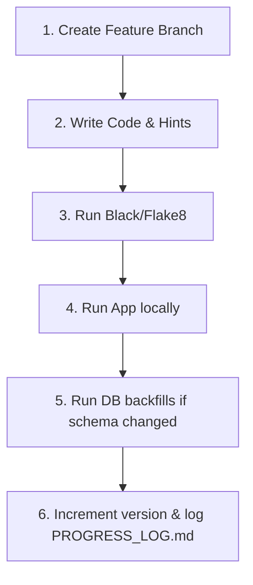

# ⚠️ Contributing and Error Handling Guide

This guide details error handling mechanisms, automated bypass retries, coding conventions, and developer guidelines for contributing to **YT-AIO**.

---

## 1. Error Isolation and Subprocess Catching

Background downloading tasks run inside a parallel thread execution pool. It is critical that **one failed download does not crash the entire batch download**.

To achieve this, YT-AIO wraps download actions in isolated exception boundaries:

1. **Per-Video Isolation**: Each target is executed inside its own `try-except` block in `download_one()`. If a subprocess fails, it raises an exception which is caught inside the thread. The worker logs the error code and moves directly to the next target.
2. **Subprocess Pipe Control**: We execute `yt-dlp` using `subprocess.Popen` instead of blocking calls. We drain the pipe buffers line-by-line (`process.stdout.readline()`) to prevent timeouts caused by full buffer blocks.
3. **Database Error Hooks**: Any exception caught in the worker thread calls `log_error(db_path, payload)` to dump:
   - Python traceback strings (`traceback.format_exc()`).
   - The specific URL that triggered the error.
   - The script version.
   - Platform OS details.

---

## 2. Anti-Bot Challenges & Cookie Decryption Fallback

YouTube frequently runs scraper block checks (returning `HTTP Error 429: Too Many Requests` or request challenges).

To bypass this without user interaction:
1. When `run_json_command()` or `download_one()` parses subprocess output and detects bot indicators, it halts execution.
2. The orchestrator triggers a retry by passing `use_cookies=True` to the command builder.
3. The command builder looks up browser databases (defaulting to the **Brave Browser** profile storage path).
4. It reads active decrypted session cookies and appends the `--cookies-from-browser brave` argument to the `yt-dlp` subprocess command line.
5. If the browser profile is loaded successfully, the challenge is bypassed, and the download completes.

---

## 3. Coding Style & Linting Standards

To maintain clean code in the repository:

- **Formatting**: Run **`black`** to auto-format files. Keep lines under 120 characters:
  ```bash
  black --line-length 120 yt_aio/
  ```
- **Linter Checks**: Run **`flake8`** or **`pylint`** to check for unused imports and syntax inconsistencies:
  ```bash
  flake8 yt_aio/
  ```
- **Type Hinting**: Provide Python type hints on all newly added functions:
  ```python
  def log_error(db_path: Path, payload: dict) -> None:
  ```

---

## 4. How to Add a New Feature

If you are tasked with implementing a new option or database schema feature:



### **Step 1: Write Modular Code**
Place UI components inside [application/ui/](file:///home/itzzinfinity/GitHub/yt_aio/yt_aio/application/ui/), helper utilities inside [application/utils/](file:///home/itzzinfinity/GitHub/yt_aio/yt_aio/yt_aio/application/utils/), and SQLite operations inside [application/db/](file:///home/itzzinfinity/GitHub/yt_aio/yt_aio/application/db/).

### **Step 2: Update Version & Log Entries**
Whenever you deploy a patch fix or feature:
1. Increment the version number in [README.md](file:///home/itzzinfinity/GitHub/yt_aio/README.md) and [__init__.py](file:///home/itzzinfinity/GitHub/yt_aio/yt_aio/__init__.py).
2. Document the change under a timestamped header inside [PROGRESS_LOG.md](file:///home/itzzinfinity/GitHub/yt_aio/PROGRESS_LOG.md):
   ```markdown
   ## 2026-05-23 15:00 IST
   - Implemented feature X in modules Y and Z
   - Created database migrations for table logs
   ```
3. Update the SQLite `yt_aio_version` record so the internal database version aligns with the package release.
