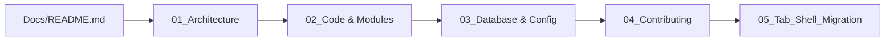

# 🚀 YT-AIO Developer Onboarding Guide & Dashboard

Welcome to **YT-AIO (YouTube All In One)** — a PyQt-based desktop application that orchestrates YouTube video downloads and audio extractions. This dashboard is designed for new developers to quickly understand the project structure, tech stack, and execution flows.

---

## 📋 Quick Start Onboarding Path

To get up to speed with the codebase, follow this curated, step-by-step reading roadmap. Do not try to read the entire codebase at once; follow this sequence:



### **Recommended Reading Sequence**
1. **[Onboarding Landing Page (This File)](file:///home/itzzinfinity/GitHub/yt_aio/Docs/README.md)** (10 min) — Overview, installation, usage, and high-level layout.
2. **[01_ARCHITECTURE_AND_THREADING.md](file:///home/itzzinfinity/GitHub/yt_aio/Docs/01_ARCHITECTURE_AND_THREADING.md)** (15 min) — Thread boundaries, task threading model, and sequential data flows.
3. **[02_CODE_AND_MODULES.md](file:///home/itzzinfinity/GitHub/yt_aio/Docs/02_CODE_AND_MODULES.md)** (20 min) — Module guide, entry functions cheatsheet, and implementation pseudo-code.
4. **[03_DATABASE_AND_CONFIG.md](file:///home/itzzinfinity/GitHub/yt_aio/Docs/03_DATABASE_AND_CONFIG.md)** (15 min) — Relational schema structures, metadata caching, and configuration handling.
5. **[04_CONTRIBUTING_AND_ERRORS.md](file:///home/itzzinfinity/GitHub/yt_aio/Docs/04_CONTRIBUTING_AND_ERRORS.md)** (10 min) — Error capture workflows, test cases, and coding style guidelines.
6. **[05_TAB_SHELL_MIGRATION.md](file:///home/itzzinfinity/GitHub/yt_aio/Docs/05_TAB_SHELL_MIGRATION.md)** (20 min) — FSD 1.7.2: the plan for moving the app into a tab shell so each new feature is its own tab.

---

## 🔍 How to Find Which Functions Do What

When you need to modify or debug a specific feature, use this quick reference table to find the target source file:

| If you want to change... | Key Entry Function | File Scheme Link |
|---|---|---|
| **App Startup & Tab Bar** | `AppShell.__init__()`, `main()` | [shell.py](file:///home/itzzinfinity/GitHub/yt_aio/yt_aio/application/shell.py) |
| **Downloader Tab Layout & Slots** | `DownloaderPanel.__init__()` | [panel.py](file:///home/itzzinfinity/GitHub/yt_aio/yt_aio/application/features/downloader/panel.py) |
| **QThread Worker Tasks** | `TaskThread.run()` | [jobs.py](file:///home/itzzinfinity/GitHub/yt_aio/yt_aio/application/jobs.py) |
| **Config Reload & DB Path** | `AppContext.reload_if_changed()` | [context.py](file:///home/itzzinfinity/GitHub/yt_aio/yt_aio/application/context.py) |
| **PyQt6 / PyQt5 Compatibility** | `QT_API`, `exec_app()` | [qt.py](file:///home/itzzinfinity/GitHub/yt_aio/yt_aio/application/ui/qt.py) |
| **Reading Logs & History** | `fetch_view()`, `LOG_VIEWS` | [queries.py](file:///home/itzzinfinity/GitHub/yt_aio/yt_aio/application/db/queries.py) |
| **Library Filters & Deletion** | `fetch_videos()`, `delete_videos()` | [queries.py](file:///home/itzzinfinity/GitHub/yt_aio/yt_aio/application/db/queries.py) |
| **Backup File Parsing** | `parse_backup_file()` | [parsers.py](file:///home/itzzinfinity/GitHub/yt_aio/yt_aio/application/features/importer/parsers.py) |
| **Editing Settings From The UI** | `SettingsPanel._save()` | [settings/panel.py](file:///home/itzzinfinity/GitHub/yt_aio/yt_aio/application/features/settings/panel.py) |
| **Styling, Hover Effects, QSS** | Styles definitions | [styles.qss](file:///home/itzzinfinity/GitHub/yt_aio/yt_aio/application/ui/styles.qss) |
| **Channel/Playlist Listing** | `list_videos()` | [video_info_extractor.py](file:///home/itzzinfinity/GitHub/yt_aio/yt_aio/application/utils/video_info_extractor.py) |
| **Single Video Metadata Fetching** | `fetch_video_metadata()` | [video_info_extractor.py](file:///home/itzzinfinity/GitHub/yt_aio/yt_aio/application/utils/video_info_extractor.py) |
| **Subprocess Execution Retries** | `run_json_command()` | [video_info_extractor.py](file:///home/itzzinfinity/GitHub/yt_aio/yt_aio/application/utils/video_info_extractor.py) |
| **Download Orchestration** | `download_many()` | [download_manager.py](file:///home/itzzinfinity/GitHub/yt_aio/yt_aio/application/utils/download_manager.py) |
| **Single Video Subprocess Download** | `download_one()` | [download_manager.py](file:///home/itzzinfinity/GitHub/yt_aio/yt_aio/application/utils/download_manager.py) |
| **Path & Config Key Resolution** | `resolve_runtime_config()` | [config_manager.py](file:///home/itzzinfinity/GitHub/yt_aio/yt_aio/application/utils/config_manager.py) |
| **Thread-Safe Cancellation Flag** | `CancellationToken` | [shared.py](file:///home/itzzinfinity/GitHub/yt_aio/yt_aio/application/utils/shared.py) |
| **Database Schemas / Log Inserts** | `init_db()`, `log_download()` | [database_manager.py](file:///home/itzzinfinity/GitHub/yt_aio/yt_aio/application/db/database_manager.py) |
| **User Editable Defaults** | Settings keys | [config.json](file:///home/itzzinfinity/GitHub/yt_aio/yt_aio/application/config/config.json) |

---

## 🎯 Project Overview & Goal

The primary goal of **YT-AIO** is to provide a clean, user-friendly desktop GUI wrapper for automated YouTube downloading and scraping operations. 

It isolates the complexity of downloading streams by using `yt-dlp` as a subprocess engine while maintaining local video details in a structured SQLite database. This database acts as a **cache layer** to eliminate repetitive metadata fetches from the YouTube API, speeding up loading channels and playlists.

---

## ✨ Key Features

- **Channel & Playlist Scraper**: Extracts all video lists with upload dates, views, durations, and formats.
- **Selectable Download Table**: Displays all items with checkmarks so you can selectively download a subset of videos.
- **Dual Media Extraction**: Download full video stream (best quality) or extract audio-only (automatic `.m4a` conversion).
- **Parallel Task Workers**: Spawns multiple downloads in parallel (up to CPU cores - 2) using a python thread pool.
- **YouTube Bot Bypass Fallback**: Detects HTTP 429 block errors or bot challenges and automatically reads cookie data from browser profiles (e.g. Brave) to retry.
- **State Persistence & Audit Trail**: Keeps a relational record of download logs, settings changes, user button clicks, and application errors.
- **Path Portability**: Automatically converts relative paths inside `config.json` into project-relative absolute paths at runtime, letting you move the application directory anywhere.

---

## ⚙️ Tech Stack & Dependencies

- **Language**: Python 3.8+
- **GUI Engine**: PyQt5 or PyQt6 (auto-detected and loaded dynamically)
- **Scraping Engine**: `yt-dlp` CLI (subprocess-based, Python runtime-compatible)
- **Storage Layer**: SQLite3 (embedded file, WAL mode enabled for concurrent reads)
- **Styling**: Qt Stylesheets (QSS)
- **Optional Fallback**: Brave Browser (or Chrome/Firefox) to fetch authentication cookies

---

## 🔧 Installation & Setup

Follow these steps to configure your local development environment:

### **1. Verify Prerequisites**
Ensure you have Python 3.8 or higher installed on your system:
```bash
python3 --version
```

### **2. Setup a Virtual Environment**
Creating a virtual environment separates project packages from your system packages:
```bash
# Create the environment
python3 -m venv venv

# Activate it (Linux / macOS)
source venv/bin/activate

# OR Activate it (Windows)
venv\Scripts\activate
```

### **3. Install Python Dependencies**
Install PyQt5 and yt-dlp into your environment:
```bash
pip install --upgrade pip setuptools wheel
pip install PyQt5 yt-dlp
```
*Note: If you prefer PyQt6, you can run `pip install PyQt6 yt-dlp` instead. The application handles either.*

### **4. Verify system imports**
Make sure the main dependencies load properly:
```bash
python3 -c "import PyQt5; import yt_dlp; print('Dependencies OK')"
```

---

## 🚀 Usage Guide

### **Running the Application**
To start the PyQt graphical interface, run the python module execution command from the project root:
```bash
python3 -m yt_aio
```

On first launch, the program automatically:
1. Creates [config.json](file:///home/itzzinfinity/GitHub/yt_aio/yt_aio/application/config/config.json) in `yt_aio/application/config/` containing default settings.
2. Initializes the SQLite database file `yt_aio.db` in `yt_aio/application/db/` and populates the tables schema.
3. Opens the primary dark-themed window.

### **Interactive Workflows**
1. **Load a Channel / Playlist**:
   - Paste a channel URL (e.g. `https://www.youtube.com/@vsauce`) or playlist URL.
   - Click **Download** (with the table empty). The app starts scanning video IDs and fetches metadata, filling the grid.
2. **Download Selection**:
   - Check the boxes next to the videos you want to download.
   - Choose **Audio** or **Video** options.
   - Click **Download** again to trigger the parallel download threads.
3. **Quick Download**:
   - Paste comma-separated URLs in the **Quick Download** text box.
   - Click **Download** to process them directly, bypassing the listing step.

---

## 📊 High-Level Architecture Overview

YT-AIO utilizes a decoupled **three-layer architecture** with strict separation of responsibilities:

```
┌────────────────────────────────────────────────────────┐
│ SHELL LAYER                                            │
│ - AppShell: Import, Downloader, Library, Logs, Settings│
│ - AppContext: shared config and database path          │
└──────────────────────────┬─────────────────────────────┘
                           │ constructs one panel per tab
                           ▼
┌────────────────────────────────────────────────────────┐
│ UI PRESENTATION LAYER (one panel per feature tab)      │
│ - DownloaderPanel: listens to UI buttons, redraws grid │
│ - TaskThread: Spawns a background thread per task      │
└──────────────────────────┬─────────────────────────────┘
                           │ QThread signals
                           ▼
┌────────────────────────────────────────────────────────┐
│ SERVICES / BUSINESS LOGIC                              │
│ - VideoInfoExtractor: Flat scraper, parallel fetcher   │
│ - DownloadManager: Process pools, format selection     │
│ - ConfigManager: Setting validations, path builder     │
└──────────────────────────┬─────────────────────────────┘
                           │ SQLite Query Operations
                           ▼
┌────────────────────────────────────────────────────────┐
│ DATA PERSISTENCE LAYER                                 │
│ - DatabaseManager: Connects WAL DB, caches metadata    │
│ - yt_aio.db: Local SQLite storage file                 │
└────────────────────────────────────────────────────────┘
```

The next guide delves into the structural threads and step-by-step workflow diagrams.

**Next Guide:** Read **[01_ARCHITECTURE_AND_THREADING.md](01_ARCHITECTURE_AND_THREADING.md)**
